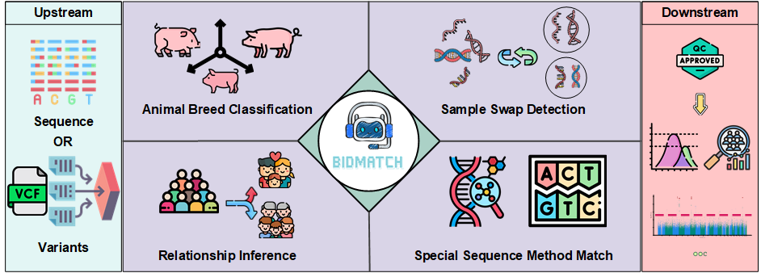
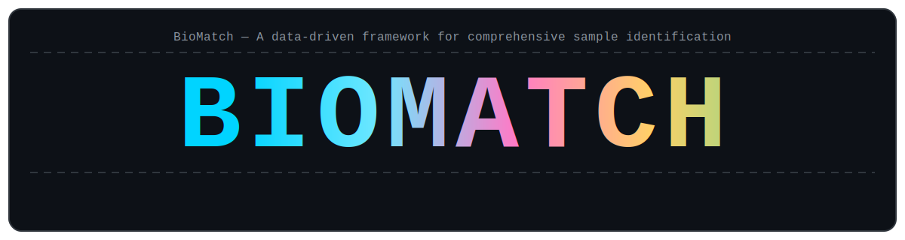

# BioMatch

BioMatch is a data‑driven workflow for sample identity matching. It covers k‑mer panel generation, k‑mer counting for FASTA/FASTQ, and evaluation on VCF/PLINK with integrated statistical summaries.

<!-- Badges: conda downloads/version, environment -->
[](https://anaconda.org/bioconda/biomatch)
[](https://anaconda.org/VonPoo/r-deepkin)
[](https://anaconda.org/bioconda/biomatch)
[](https://anaconda.org/vonpoo/r-deepkin)


<!-- Graphical Abstract -->
<div align="center">
  
</div>

<div align="center">
  
</div>


## Installation (Conda only)

Create and populate the environment with the required channels and packages (installation is intentionally restricted to Conda):

```bash
conda create -y -n biomatch_env python=3.11 r-base=4.3.2 -c conda-forge
conda install -y -n biomatch_env -c conda-forge -c bioconda biomatch
conda activate biomatch_env
```

## Features
- Generate k‑mer panels from a reference genome and a population VCF
- Count k‑mers from FASTA/FASTQ inputs (SE or PE)
- Evaluate samples from VCF or PLINK (includes DeepKin summaries)
- Special sequencing support via `--keep-base` filtering (e.g., WGBS)
- Built‑in directory layout and `--list-panels` helper

## Highlights
- Colorized CLI with a startup ASCII banner; toggle via `--color`.
- Built‑in autosome mappings for common species; override with `--chr`.
- Panels can be listed with `--list-panels` and are discoverable under Conda `share/biomatch/kmer_ref_panels` if provided.
- Designed to interoperate with PLINK1/PLINK2 and bcftools for robust pipelines.

## Quick Start

The CLI supports the following modes (0.4.4):

1) Generate panel only
```bash
biomatch --gen-panel \
  --ref /path/to/reference.fa \
  --pop-vcf /path/to/population.vcf.gz \
  --chr-set 22 \
  --panel-name Human_ref_hg38
```

2) Generate panel, count, and evaluate
```bash
biomatch --gen-panel \
  --ref /path/to/reference.fa \
  --pop-vcf /path/to/population.vcf.gz \
  --chr-set 22 \
  --panel-name Human_ref_hg38 \
  --count /path/to/samples_dir \
  --count-db /path/to/count_results \
  --eval-result /path/to/eval_results
```

3) Counting & evaluation with an existing panel (parallel)
```bash
biomatch --panel-name Human_ref_hg38 \
  --count /path/to/samples_dir \
  --count-db /path/to/count_results \
  -t 20 \
  --eval-result /path/to/eval_results
```

4) BioMatch evaluation on VCF/PLINK (recommended `--keep-base`)
```bash
# Automatically detects .vcf/.vcf.gz or PLINK (.bed/.bim/.fam or .pgen/.psam/.pvar) in the directory
biomatch --match /path/to/vcf_or_plink_dir \
  --species human \
  --keep-base ATC \
  --eval-result /path/to/eval_results

# If species mapping is not available, specify chromosome count directly
biomatch --match /path/to/vcf_or_plink_dir \
  --chr 22 \
  --eval-result /path/to/eval_results
```

5) Default evaluation on counting results
```bash
biomatch --count-db /path/to/count_results --eval-result /path/to/eval_results
```

Notes:
- `--keep-base` retains variants whose alleles are strictly composed of allowed bases; e.g., `ATC` or `A,T,C`.
- `--list-panels` lists available panel names in the installed directories.
- For large panel directories, keep them outside your repo and mount/share under the Conda prefix (`$CONDA_PREFIX/share/biomatch/kmer_ref_panels`).

## Example Dataset

This repository includes a minimal PLINK example at `test_eval/` containing `genomic.*` and `non_genomic.*` triplets. Run:

```bash
biomatch --match test_eval \
  --species human \
  --eval-result eval_result_test/output
```

Outputs include `params.RData`, `results.deepkin`, `deepkin_summary.txt`, and `final_results.related.csv`.

## Panels and Layout

The package embeds a minimal Human example panel. Larger species panels are best distributed via a GitHub Release or Git LFS.

## Related Resources
- iDIGs2 (pig breed identification & panel design): `https://alphaindex.zju.edu.cn/iDIGs2/`
- UPGG (Unified Pig Gastrointestinal Genome Database): `https://alphaindex.zju.edu.cn/upgg/#/`

## FAQ
- How do I show today/total visitors or downloads in badges?
  - Provide a small JSON endpoint (Shields `endpoint` style) from your site and reference it in README; or use `hits.seeyoufarm.com` for quick visitor counts.
- Can I install without Conda?
  - Not supported. BioMatch is distributed and tested via Conda only to ensure R/PLINK dependencies.
- Where are analysis scripts?
  - Installed under `biomatch/analysis_scripts/` and copied on first run for reproducibility.

## Troubleshooting
- R packages not found: ensure the environment includes DeepKin and tidyverse family compatible with `r-base=4.3.2`.
- Panel not found: verify `--panel-name` matches the file basename (suffix `.fa` is not required).
 - PLINK path issues: BioMatch will prefer PLINK2 when available; otherwise it falls back to PLINK1. Ensure binaries are on `PATH`.

## License
MIT
